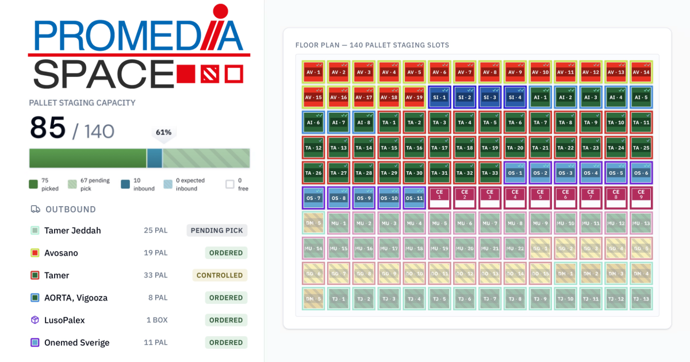

<div align="center">


# PROMEDIA SPACE

**Version 1.0**

*An internal web tool for monitoring warehouse utilization, staging capacity, and inbound/outbound logistics*

*Built by [Engin Sarak](https://github.com/EnginSarak)*


</div>

---

## Table of Contents

- [Overview](#overview)
- [Features](#features)
  - [Dashboard](#dashboard)
  - [Tile System](#tile-system)
  - [Outbound Order Management](#outbound-order-management)
  - [Inbound Tracking](#inbound-tracking)
  - [Bin Usage Monitoring](#bin-usage-monitoring)
  - [Forecast Mode](#forecast-mode)
  - [Task List](#task-list)
  - [Monitor Mode](#monitor-mode)
  - [Maintenance Panel](#maintenance-panel)
  - [Theming](#theming)
- [Access Control](#access-control)

---

## Overview

PROMEDIA SPACE is a closed-source, access-controlled internal web application built for Promedia's logistics operations. It provides a visual overview of the warehouse floor, showing which pallet staging slots are occupied, pending, or free.

The tool is designed for daily use by logistics coordinators and inventory owners to:

- Avoid over-committing staging space
- Give all involved parties a shared and accurate picture of current warehouse status
- Track outbound orders through their full lifecycle from picking to pickup
- Monitor inbound stock arrivals (expected and already received)
- Log and analyze daily bin occupancy over time
- Plan ahead using the Forecast mode to preview future capacity
- Manage customs export document workflows via the integrated Task List

Access is token-based (no user accounts or login forms)

---

## Preview

<div align="center">
  
</div>

---

## Features

### Dashboard

The main dashboard is the default view after authentication. It is fully read-only for Viewer-role users and provides an up to date snapshot of the warehouse status.

**Warehouse Floor Map**
A responsive grid of all pallet staging slots, each rendered as a colored tile. The grid is color-coded by customer and destination country simultaneously:

- The tile background reflects the **destination country** (fixed palette of all countries)
- The tile border reflects the **customer** (dynamically assigned, persisted color)
- Tiles animate in sequentially from left to right on page load

**Capacity Bar**
A segmented progress bar showing the current breakdown of staging capacity:

| Segment | Color | Meaning |
|---|---|---|
| Picked | Solid | Orders picked and staged |
| Pending Outbound | Dashed | Ordered but not yet confirmed |
| Arrived Inbound | Solid | Stock deliveries that have arrived |
| Expected Inbound | Dashed | Future-dated inbound reservations |

Above the bar, **two pointers** indicate capacity levels at a glance:

- **Solid pointer** — shows the percentage of slots currently occupied (picked + arrived inbound)
- **Dashed pulsing pointer** — appears only when pending pick or expected inbound entries are present, pointing to the projected total including all pending items

A warning indicator appears automatically when the combined total (including pending) exceeds configured capacity.

**Outbound Panel (Customer Sidebar)**
Lists all active outbound orders with customer name, pallet count, destination country, and a status badge reflecting the current order lifecycle stage. Maintainers also see:

- A red printed badge next to orders whose pick list has been printed
- A yellow warning triangle next to orders with open tasks in the Task List

**Inbound Panel (Inbound Sidebar)**
Lists manually logged inbound deliveries — both upcoming (shown as "Expected") and already received ("Arrived"). Each entry shows supplier, pallet count, and expected/actual date.

**Bin Usage Panel (Bin Usage Sidebar)**
Shows today's bin occupancy as a ratio against total configured bin count, with a color-coded utilization bar. Also displays the current month's daily average and a log of recent entries.

---

### Tile System

Each occupied pallet slot on the floor map is rendered as an interactive tile containing:

- **Customer abbreviation** — a short label identifying the customer
- **Pallet index** — the position of this tile within the customer's group (e.g. `2/5`)
- **Country-coded background** — fixed dark colors per destination country (IT, DE, FR, PL, ES, BE, DK, SE, LT, CH, QA, NL, AT, UK, and more)
- **Customer-coded border** — dynamically assigned, unique color per customer, persisted across sessions
- **Status corner markers** — small symbols in the top-right corner of tiles indicating progress:

| Symbol | Status |
|---|---|
| `✓` | Controlled |
| `✓✓` | Ordered |
| `★` | Confirmed |

**Hover Behavior**
Hovering over any tile highlights the hovered customer's group, making it easy to identify which slots belong to the same shipment across a busy floor map.

**Tile Detail Modal**
Clicking or tapping any tile opens a full detail card showing all available order data: customer name, delivery date, picks, SORD number, destination country, forwarder, colli count, internal notes, and current status.

Free (unoccupied) slots are rendered as empty, unfilled tiles and are not interactive.

---

### Outbound Order Management

Outbound orders follow a five-stage lifecycle:

```
Pending Pick → Picked → Controlled → Ordered → Confirmed
```

The status is derived automatically from four checkboxes (`picked`, `control`, `ordered`, `confirmed`). The floor map, capacity bar, sidebar, and tile corner markers all reflect the current stage.

**Printed Flag**
Maintainers can mark an order as "Printed" once the pick list has been physically printed for the warehouse worker. This is tracked separately from the order lifecycle and is only visible to Maintainers — Viewer and Customer Service roles do not see it. A small red badge appears next to the customer name in the sidebar and Outbound Viewer when printed.

**Picked Up Date**
When an order is marked as Picked Up, it moves to the History view. The history entry receives an automatic pickup date (shown in orange). Maintainers can confirm or correct the date by clicking it — once edited, it turns green to indicate manual confirmation.

When an order is marked as **Picked Up**, it is automatically archived into a history collection, visible and manageable within the Maintenance Panel. Archived entries are retained for **365 days** before expiry.

**Export Declaration Detection (EX1)**
When a new outbound order is created with a non-EU destination country (e.g. CH, GB, SA), the system automatically detects this and asks whether the shipment's customs value or gross weight exceeds 1,000 (€ or kg). If confirmed, an EX1 customs checklist task is automatically created and linked to that order, ensuring the export document workflow is tracked without manual effort.

---

### Inbound Tracking

Inbound deliveries can be pre-registered with a supplier name, pallet count, and an expected arrival date.

- **Future-dated entries** appear on the floor map as dashed tiles and are counted as "Expected Inbound" in the capacity bar
- **Past-dated or same-day entries** are treated as "Arrived Inbound" and shown as solid-colored tiles

Inbound tiles are visually distinct from outbound tiles by their shape: outbound slots appear as fully closed squares, while inbound tiles are rendered half-open (cut-off top edge) to signal a different occupancy type at a glance.

---

### Bin Usage Monitoring

The bin usage feature tracks the number of bins occupied on each day, independently of pallet staging. Maintainers can:

- Log today's bin count (with the option to backdate missed entries via a date picker)
- Edit or delete past entries
- View the current month's daily average

The Bin Usage Sidebar on the dashboard shows a utilization bar color-coded by fill level, today's count vs. total, monthly average, and a recent log. Historical entries are grouped by ISO calendar week (weekdays only), with each page showing one full week (Mon–Fri, up to 5 entries) labeled with its week number.

---

### Forecast Mode

The Forecast button (calendar icon) in the Floor Plan card header opens a date picker that lets you preview the projected warehouse state on any future date. The floor map and capacity bar switch to forecast mode, showing:

- Inbound deliveries expected to have arrived by the selected date
- Outbound orders still likely to be staged (based on their delivery date)

The forecast banner clearly indicates this is a projection, not live data, and includes a "Back to Live" link to exit the mode. Day-by-day navigation is possible using the arrow buttons flanking the Forecast button, without reopening the calendar.

NRW public holidays are highlighted in red in the date picker and trigger a warning banner when selected, noting that no pickups are expected on that day.

---

### Task List

The Task List is a workflow management module accessible exclusively to **Maintainer** roles via a clipboard icon button in the dashboard header. An orange/red notification badge on the button shows the number of open tasks.

Clicking the button opens a side panel listing all tasks. Each task has:

- A **type badge** (EX1 for customs export tasks, or General for free-form notes)
- A **title** and optional link to a specific outbound or inbound order
- A **progress bar** and **checklist** of sub-items that can be checked off individually
- A **Mark done** button to archive it into the Completed section
- A **Delete** button to remove it entirely

**EX1 Tasks** are created automatically when a new outbound order is saved with a non-EU country and the user confirms the customs value threshold. They come pre-filled with a six-step checklist:

1. Sales Invoice requested
2. Sales Invoice received
3. Invoice sent to CE-Customs
4. EX1 requested from CE-Customs
5. EX1 received
6. EX1 printed for warehouse staff

EX1 tasks can also be created manually and linked to inbound deliveries when needed.

**General Tasks** can be created manually from the Task List panel with a custom title and optional order link. This supports ad-hoc to-do items such as warehouse queries, damage reports, or follow-up reminders.

**Checklist Management**
Both EX1 and General tasks support full checklist editing without leaving the Task List panel. While a task is open, clicking **Edit** next to the checklist header switches it into edit mode:

- **Add steps** — type a label and press Enter or click the `+` button (up to 8 items per task)
- **Edit labels** — click the pencil icon on any item to rename it inline; confirm with Enter or the check button
- **Reorder** — long-press the grip handle on any item and drag it to a new position; surrounding items shift to indicate the drop target
- **Remove** — delete individual items with the trash icon at any point

Changes sync immediately, so the checklist state is always consistent across users.

**Linking to orders**
When creating a task manually, the order link can point to either an outbound order or an inbound delivery — toggle between the two with the Outbound / Inbound selector in the form before picking from the dropdown.

When an order has open linked tasks, a yellow warning triangle appears next to the customer name in the relevant Sidebar and the Viewer table, making it immediately visible that something requires attention. This indicator is only shown to Maintainer role.

---

### Monitor Mode

The Monitor button in the dashboard header is available exclusively to the **Warehouse Operator** role. Activating it switches the application into a fullscreen display layout intended for TV monitors in the warehouse.

In Monitor Mode the normal dashboard layout is replaced with two alternating full-screen views that cycle automatically:

- **Floor Screen** — displays the capacity bar, the warehouse grid, and the inbound sidebar. Shown for 15 seconds.
- **Board Screen** — a large-format outbound order table listing customer, picks, SORD number, country, delivered-by date, forwarder, colli count, and current status. When orders span multiple pages, each page is shown for 10 seconds with dot indicators showing the current page. The total board duration scales dynamically with the number of pages, so every page always gets equal time before switching back to the floor screen.

The header slides offscreen after a moment and reappears on any mouse movement or touch — keeping the display clean when no one is interacting with it. Pressing **F5** while in Monitor Mode toggles the browser into or out of fullscreen without refreshing the page.

Monitor Mode state is remembered per token, so a dedicated warehouse display can be set up once and stays in monitor layout across page reloads.

---

### Maintenance Panel

The Maintenance Panel is accessible to **Maintainer** and **Customer Service** roles. It opens as a fullscreen-capable overlay with four tabbed sections.

#### Outbound Tab

**For Maintainers — full access:**
- Fully editable table with inline editing for all order fields (customer, date, picks, SORD number, country, forwarder, colli, notes)
- Checkbox columns: Printed, Picked, Controlled, Ordered, Confirmed, Picked Up — saved immediately on change
- Text field changes are batched and saved together via a **Save Changes** button
- **Add Row** button to manually create a new blank order
- **Delete** individual orders
- **Undo** — reverts the last action (up to 10 steps)
- **History** — view and manage archived (picked-up) orders, with editable and color-coded pickup dates

**For Customer Service — restricted access:**
- Can add new rows and edit text fields (customer, date, picks, SORD number, country, delivered by, forwarder, colli, notes)
- All checkbox columns (Printed, Picked, Controlled, Ordered, Confirmed, Picked Up) are greyed out and read-only
- Delete button is hidden — existing orders cannot be removed
- History is visible but fully read-only — no date editing, no restore, no delete

#### Inbound Tab
Both Maintainer and Customer Service have full access:
- Add new inbound deliveries (supplier, pallet count, expected date)
- Edit existing entries
- Delete entries

#### Config Tab
- Maintainer only — adjust total pallet staging capacity, total bin count, log and manage bin usage entries
- Greyed out and inaccessible for Customer Service

#### Users Tab
- Maintainer only — generate new access tokens with selectable role (Viewer, Customer Service, or Maintainer), copy tokens to clipboard, delete tokens to revoke access
- Greyed out and inaccessible for Customer Service

---

### Theming

PROMEDIA SPACE supports three theme modes, switchable via a toggle in the dashboard header:

| Mode | Behaviour |
|---|---|
| `system` | Follows the OS/browser preference automatically |
| `light` | Forces light mode regardless of system setting |
| `dark` | Forces dark mode regardless of system setting |

The selected theme is saved and restored on every visit. The login screen also adapts to the current theme — including switching between the light and dark mode logo assets.

---

## Access Control

PROMEDIA SPACE uses a **token-based access model** — there are no user accounts, passwords, or registration flows. Tokens are issued by a Maintainer via the Users tab of the Maintenance Panel.

| Role | Access |
|---|---|
| **Viewer** | Dashboard only — read-only view of all live data |
| **Customer Service** | Dashboard + Maintenance Panel (Outbound tab with restrictions, Inbound tab full access) — no Config, no Users, no Task List |
| **Maintainer** | Dashboard + full Maintenance Panel (all tabs) + Task List + Printed badge + warning triangles |
| **Warehouse Operator** | Dashboard only (read-only) + Monitor Mode |

Once a valid token is entered on the login screen, it is saved in the browser and automatically validated on subsequent visits. Logging out clears the saved token and role.

---

<div align="center">

**PROMEDIA SPACE** is proprietary software developed for internal use at Promedia Medizintechnik A. Ahnfeldt GmbH.  
Unauthorized access, redistribution, or use is not permitted.

*Built by [Engin Sarak](https://github.com/EnginSarak) · © Promedia Medizintechnik A. Ahnfeldt GmbH · All rights reserved*

</div>
